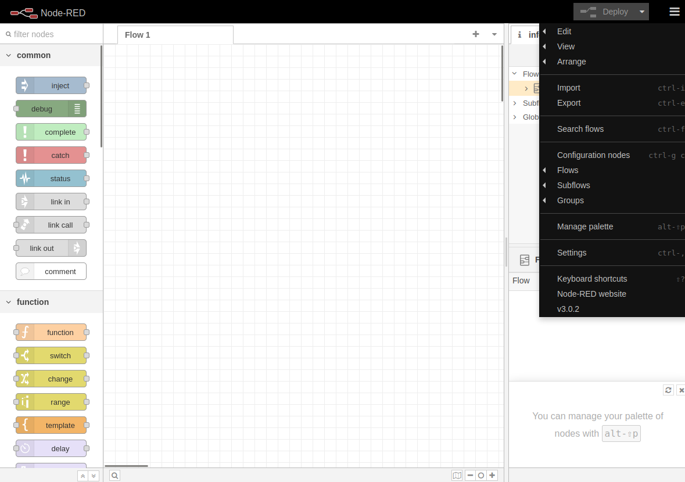
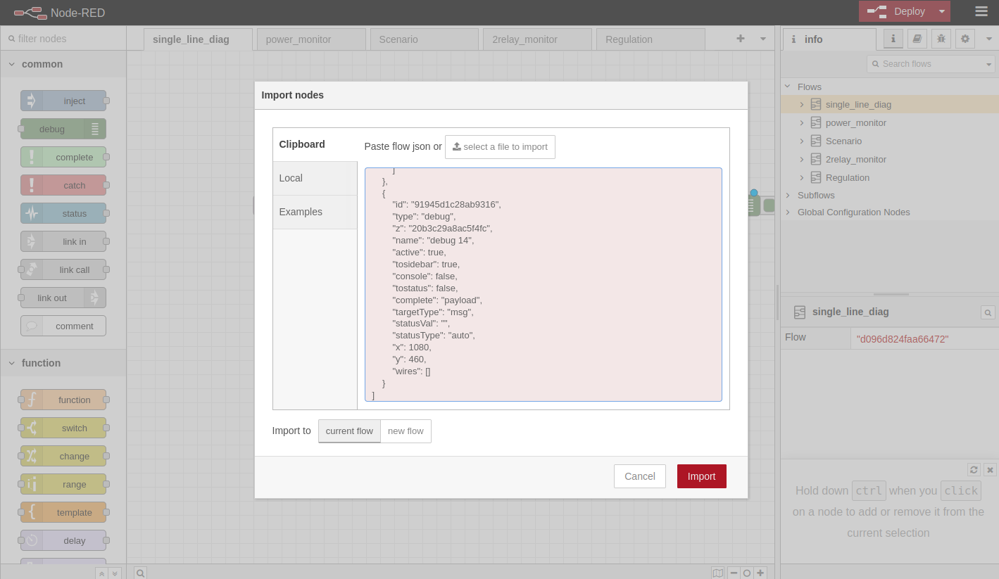
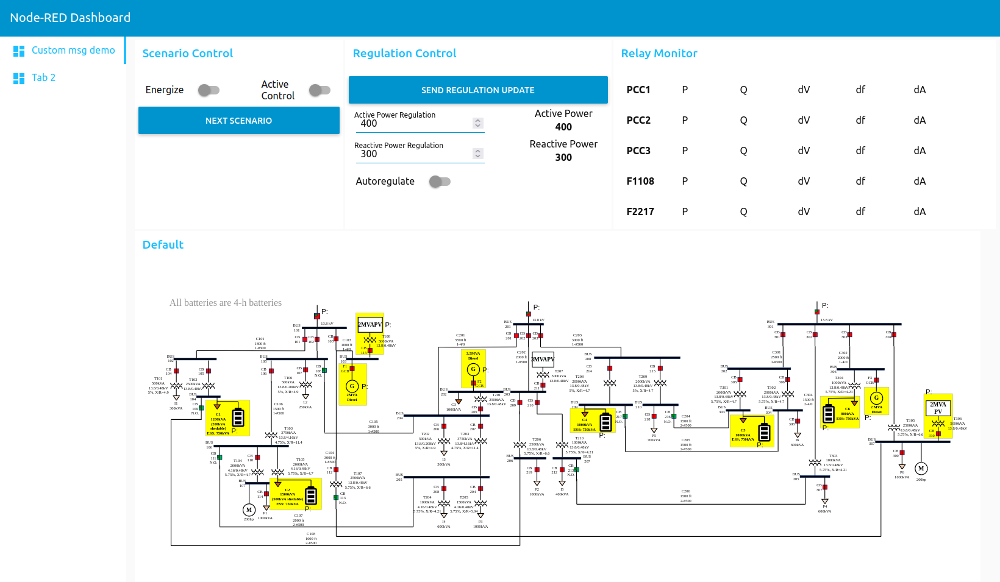
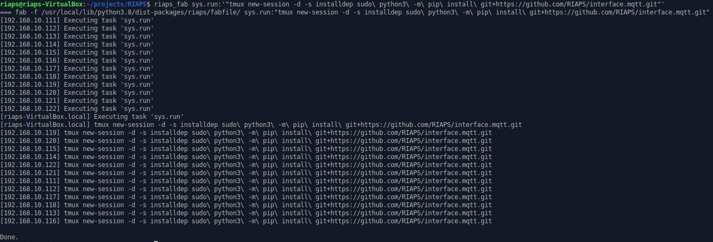
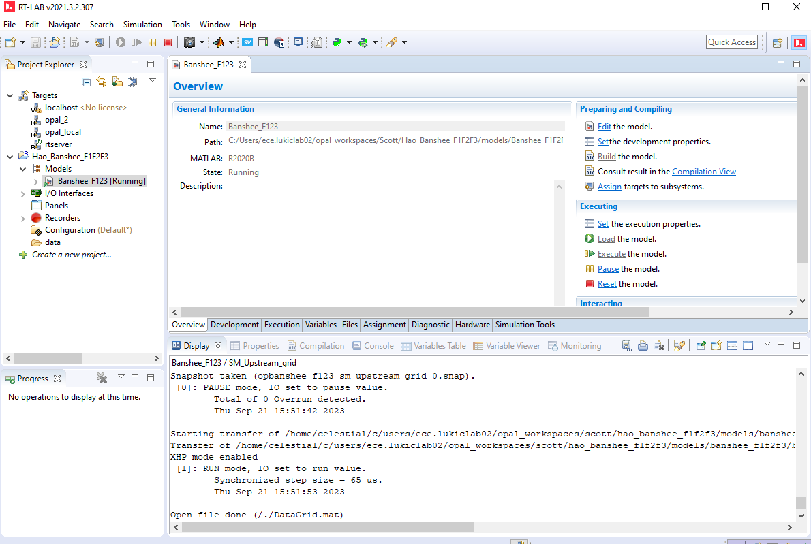
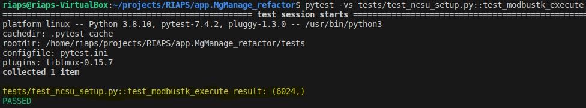
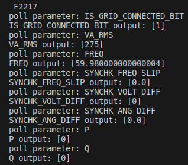
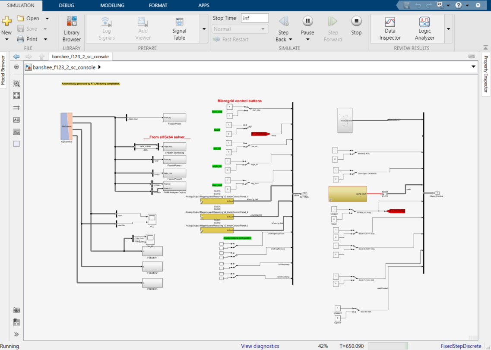
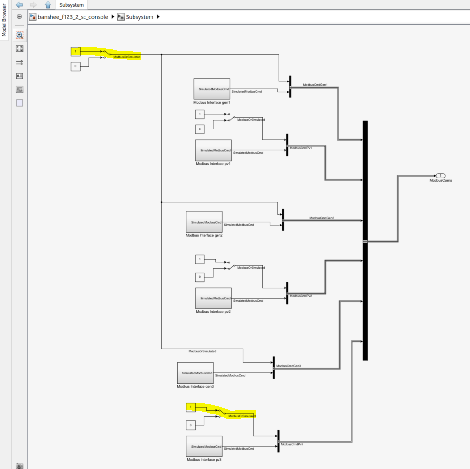
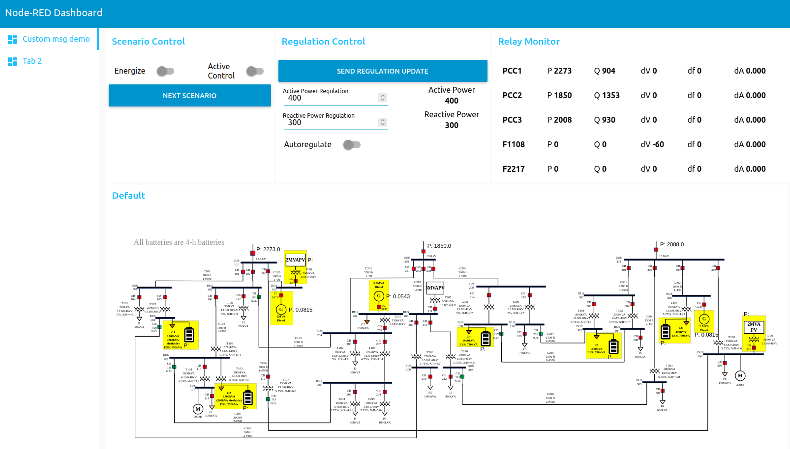

# app.IMCP

## Table of Contents

- [Project Description](#project-description)
- [Getting Started](#getting-started)
  - [Prerequisites](#prerequisites)
  - [Installation](#installation)
- [Usage](#usage)
  - [Examples](#examples)
- [Contributing](#contributing)
  - [Bug Reports](#bug-reports)
  - [Feature Requests](#feature-requests)
  - [Pull Requests](#pull-requests)
- [License](#license)
- [Acknowledgments](#acknowledgments)

## Additional Documentation
- [Folder Structure](README_pages/folder_structure.md)
- [Customizing the RIAPS Application](README_pages/customizing_the_riaps_application.md)

## Project Description
This project provides a reference implementation for the Integrated Microgrid Control Platform (IMCP). The IMCP is a distributed control application that uses a consensus algorithm to determine the set points for each DER in a microgrid. This project also provides an example RIAPS application using the IMCP on an OPAL-RT testbed running a modified version the Banshee microgrid model.

## Getting Started

### Prerequisites

Before you begin, ensure you have met the following requirements:

- [**RIAPS Development Host**](https://github.com/RIAPS/riaps-integration/blob/master/riaps-x86runtime/README.md) v1.1.22
- [**RIAPS Target Node**](https://github.com/RIAPS/riaps-integration/blob/master/riaps-node-runtime/README.md) v1.1.22
- Ensure that the [FlashMQ Version 1.4.0](https://www.flashmq.org/download/) mqtt broker is installed and running:
    ```bash
    $ flashmq --version
    FlashMQ Version 1.4.0 with SSE4.2 support
    Copyright (C) 2021,2022 Wiebe Cazemier.
    License AGPLv3: GNU AGPL version 3. <https://www.gnu.org/licenses/agpl-3.0.html>.
    
    Author: Wiebe Cazemier <wiebe@halfgaar.net>
    $ sudo systemctl status flashmq.service
    flashmq.service - FlashMQ MQTT server
     Loaded: loaded (/lib/systemd/system/flashmq.service; enabled; vendor preset: enabled)
     Active: active (running) since Thu 2023-09-21 10:11:45 CDT; 4h 21min ago
    ```
- Ensure that the mqtt broker allows anonymous connections:
    - add `allow_anonymous true` to the file `/etc/flashmq/flashmq.conf` 
    - if it is not there, after adding it, run `sudo systemctl restart flashmq.service`
- Add the *flow* to node-red ui editor to create dashboard. This is to set up the GUI that is used to interact with the application.
    1. Start node red with `node-red` in the terminal. This was tested with node-red v3.0.2.
    2. Open two browser tabs to:
        - `http://127.0.0.1:1880/`
        - `http://127.0.0.1:1880/ui/`
    3. Copy the contents of `GUI/flow5.json`
    4. In the `http://127.0.0.1:1880/` tab click the three horizontal bars in the top right corner and select `Import` or press `ctrl-i`
     
    5. Paste the contents `GUI/flow5.json` into the text field and click `Import`
    
    6. Click the red `Deploy` button
    7. Switch to the `http://127.0.0.1:1880/ui/` tab where you should see the dashboard.
    
- RT-Lab is installed and configured. 
- The [microgrid model](https://github.com/RIAPS/model.Banshee/tree/main) is configured, compiled and can be loaded and executed on the OPAL-RT target. 
    
 

### Installation

With RIAPS properly installed and configured the other dependencies can be satisfied on all target nodes simultaneously using the `riaps_fab` command.
Tmux is used to improve robustness of the install commands, in case the Development Host loses connection with the target node before the installation is complete. The status of the install on a given node can be monitored by accessing a target node via ssh and running `tmux attach -t installdep`; this will attach to the tmux session. To detach from the tmux session use the key sequence `CTRL-b,d` (press ctrl and b, release and press d).
- **Dependencies exclusive to Development Host**:
  * fabric v.1.15.0 and fabric2 v.3.2.2
  ```bash
  sudo python3 -m pip install 'fabric<2.0' 'fabric2==3.2.2'
  ```
  * [RIAPS test suite](https://github.com/RIAPS/test-suite)
  ```bash
  sudo python3 -m pip install git+https://github.com/RIAPS/test-suite.git
  ```
  * [Watchdog](https://github.com/gorakhargosh/watchdog)
  ```bash
  sudo python3 -m pip install 'watchdog==3.0.0'
  ```
- **Dependencies exclusive to Target Nodes**:
  * Configure UART
    1. SSH into the target node.
    1. Check kernel version. This repo was developed and tested with kernal 5.10.168-ti-rt-r71.
        ```bash
        $ uname -r
        5.10.168-ti-rt-r71
        ```
    1. Add the following to `/boot/uEnv.txt`. Note that the path to the dtbo file may be different depending on the kernel version.
        ```bash
        enable_uboot_overlays=1
        uboot_overlay_addr4=/usr/lib/linux-image-5.10.168-ti-rt-r71/overlays/BB-UART1-00A0.dtbo
        ```

- **Development Host and Target Dependencies**:
These can be installed on all target nodes simultaneously using the `riaps_fab` command. See below for syntax.

  * Numpy (Note: Installing numpy on a BBB will take several hours.): 
      ```bash 
      riaps_fab sys.run:'"tmux new-session -d -s install_numpy sudo\ python3\ -m\ pip\ install\ numpy==1.24.4\ "' 
      ```
  * [RIAPS modbus interface](https://github.com/RIAPS/interface.modbus.libs):
      ```bash
      riaps_fab sys.run:'"tmux new-session -d -s installdep sudo\ python3\ -m\ pip\ install\ git+https://github.com/RIAPS/interface.modbus.libs.git\ "'
      ```

  * [RIAPS mqtt interface](https://github.com/RIAPS/interface.mqtt):
      ```bash
      riaps_fab sys.run:'"tmux new-session -d -s installdep sudo\ python3\ -m\ pip\ install\ git+https://github.com/RIAPS/interface.mqtt.git"'
      ```
  Example output:
   
  * [modbus-tk](https://github.com/ljean/modbus-tk)
      ```bash
      riaps_fab sys.run:'"tmux new-session -d -s installdep sudo\ python3\ -m\ pip\ install\ modbus-tk==1.1.3"'
      ```
  * [pytest](https://docs.pytest.org/en/7.1.x/getting-started.html)
      ```bash
      riaps_fab sys.run:'"tmux new-session -d -s installdep sudo\ python3\ -m\ pip\ install\ pytest==7.4.2"'
      ```


### Verify Installation and configuration

1. **Start Opal**
  `Load` and `Execute` the OPAL-RT microgrid model. 
   
Note that the purpose of the following tests is to ensure that your testbed is properly configured. They are configured here for the OPAL-RT testbed at NCSU. If you are using a different testbed the tests will fail and you will need to modify the tests to reflect your configuration, enabling verification that your testbed is properly configured.
1. **Test modbus connection**
    Run test and check that it passed and output a result (e.g., `result: (6024,)`).
    ```bash
    pytest -vs tests/test_ncsu_setup.py::test_modbustk_execute
    ```
     
1. **Test modbus tcp configurations**
    This ensures that all the parameters we care about for the application can be read from the simulation.
    ```bash
    pytest -vs tests/test_ncsu_setup.py::test_modbus_tcp
    ```
     
1. **Test modbus serial configuration**
    This test must be run from a target node that has a serial connection.
    The NCSU testbed has BeagleBone Black target nodes connected to DSP boards.
    1. Ensure that the `sync_to_nodes.sh` script to include the ip address of the target nodes with the serial connection. For example:
        ```bash
        REMOTE_NODES=("riaps@192.168.10.111" "riaps@192.168.10.112" "riaps@192.168.10.113") 
        ```
    1. Run the `sync_to_nodes.sh` to transfer the test script and config files to the target nodes to test. 
    1. SSH into the target node.
    1. Run the test:
        ```bash
        $ pytest -vs projects/RIAPS/app.MgManage_refactor/tests/test_ncsu_setup.py::test_dsp_111
        ================= test session starts ========================================
        platform linux -- Python 3.8.10, pytest-7.4.2, pluggy-1.3.0 -- /usr/bin/python3
        cachedir: .pytest_cache
        rootdir: /home/riaps
        collected 1 item                                                                                                                                                                                                                                               

        projects/RIAPS/app.MgManage_refactor/tests/test_ncsu_setup.py::test_dsp_111 poll parameter: FREQ
        FREQ output: [60.0]
        poll parameter: VA_RMS
        VA_RMS output: [0]
        poll parameter: P
        P output: [3357]
        poll parameter: Q
        Q output: [0]
        poll parameter: VREF
        VREF output: [5.051]
        poll parameter: WREF
        WREF output: [1.038]
        PASSED
        ```
1. **Test that the test logger works**
    ```bash
    $ pytest -vs tests/test_24_app.py::test_write_test_log
    ================== test session starts ===============
    platform linux -- Python 3.8.10, pytest-7.4.2, pluggy-1.3.0 -- /usr/bin/python3
    cachedir: .pytest_cache
    rootdir: /home/riaps/projects/RIAPS/app.IMCP/tests
    configfile: pytest.ini
    plugins: libtmux-0.15.7
    collected 1 item                                                                                                                  

    tests/test_24_app.py::test_write_test_log PASSED
    ```
1. **Test the log server**
    This test helps make sure that the test configuration is valid for the Development host and is consistent with the configuration in `riaps-log.conf`.
    ```bash
    $ pytest -vs tests/test_24_app.py::test_log_server
      =============== test session starts =================
      platform linux -- Python 3.8.10, pytest-7.4.2, pluggy-1.3.0 -- /usr/bin/python3
      cachedir: .pytest_cache
      rootdir: /home/riaps/projects/RIAPS/app.IMCP/tests
      configfile: pytest.ini
      plugins: libtmux-0.15.7
      collected 1 item                                                

      tests/test_24_app.py::test_log_server[log_server0] ['127.0.0.1', '192.168.10.106', '10.0.2.15']
      test_log_server: <Process name='riaps.logger.app' pid=13231 parent=13226 started>
      PASSED
    ```
1. **Test the mqtt configuration**
    ```bash
    $ pytest -vs tests/test_24_app.py::test_mqtt_config
    ========== test session starts ======================
    platform linux -- Python 3.8.10, pytest-7.4.2, pluggy-1.3.0 -- /usr/bin/python3
    cachedir: .pytest_cache
    rootdir: /home/riaps/projects/RIAPS/app.IMCP/tests
    configfile: pytest.ini
    plugins: libtmux-0.15.7
    collected 1 item

    tests/test_24_app.py::test_mqtt_config PASSED
    ```

1. **Test that the mqtt communications are working between the test and app**
    This is an interactive test. Follow the prompts in the terminal.


    A successful run from the pytest terminal looks like this:
    ```bash
    $ pytest -vs tests/test_24_app.py::test_mqtt_2_riaps_communication
    ========= test session starts =====================================
    platform linux -- Python 3.8.10, pytest-7.4.2, pluggy-1.3.0 -- /usr/bin/python3
    cachedir: .pytest_cache
    rootdir: /home/riaps/projects/RIAPS/app.IMCP/tests
    configfile: pytest.ini
    plugins: libtmux-0.15.7
    collected 1 item                                                                                                                                                                                                                                                

    tests/test_24_app.py::test_mqtt_2_riaps_communication[mqtt_client0-log_server0] ['127.0.0.1', '192.168.10.106', '10.0.2.15']
    on_connect at 1695916746.570389 error string: No error.
    Client Names: []
    Resolved IP Addresses: {}
    IP Addresses: ['192.168.10.122']
    client list: ['192.168.10.122']
    Compiling app: IMCP_Banshee_NCSU.riaps
    Compiling deployment: IMCP_Banshee_NCSU_test.depl
    known_clients: []
    known_clients: []
    known_clients: ['192.168.10.115', '192.168.10.114', '192.168.10.122', '192.168.10.120', '192.168.10.112', '192.168.10.113', '192.168.10.111', '192.168.10.121', '192.168.10.117']
    loading application: IMCP_Banshee_NCSU
    I 192.168.10.122 IMCP_Banshee_NCSU
    is_app_loaded: True
    launching application: IMCP_Banshee_NCSU
    L 192.168.10.122 IMCP_Banshee_NCSU SYSTEM_OPERATOR_ACTOR ['--config', './cfg_ncsu/OPAL-Device.yaml', '--mqtt_config', './cfg_ncsu/mqtt.yaml', '--mqtt_subsample_rate', '5']
    is_app_launched: True
    Wait until app starts (check server_logs/<ip of system operator target>_app.log for this message: MQThread no new message) then press a key to start the DERs or q to quit.

    2023-09-28 16:00:36.609675 test's on_publish: 3
    2023-09-28 16:00:36.609853 test's on_message: mg/event b'{"StartStop": 1}')
    Halt app
    H 192.168.10.122 IMCP_Banshee_NCSU SYSTEM_OPERATOR_ACTOR
    app halted? True
    remove app
    R IMCP_Banshee_NCSU 
    app removed
    Stop controller
    controller stopped
    Test complete at 1695916843.3733027
    PASSED
    ```

   
    Output in the log file found in the System operator log (e.g., `server_logs/192.168.10.122_app.log`) should look something like this:
    ```bash
    ::[debug]::[16:00:34,470]::[24067]::MQThread no new message::
    ::[debug]::[16:00:35,477]::[24067]::MQThread no new message::
    ::[debug]::[16:00:36,484]::[24067]::MQThread no new message::
    ::[info]::[16:00:36,610]::[24067]::Message from broker: mg/event b'{"StartStop": 1}'::
    ::[info]::[16:00:36,615]::[24067]::on_trigger():{'StartStop': 1}::
    ::[info]::[16:00:36,620]::[24067]::{"timestamp": 1695916836.6196535, "level": "info", "module": "MQTT", "function": "on_trigger", "line": 29, "message": "on_trigger()", "app_event": "RECEIVED MESSAGE FROM MQTT BROKER"}::
    ::[info]::[16:00:36,639]::[24041]::
    System Operator.py - on_gui_sub
    msg {'StartStop': 1}::
    ::[info]::[16:00:36,644]::[24041]::
    System Operator.py - on_gui_sub
    self.control_values {'StartStop': 1, 'GridTiedOp': 0, 'SecCtrlEnable': 0, 'SecCtrlAngleEnable': 0, 'RegulationSignal': 0, 'RegulationSignal2': 0}::
    ::[info]::[16:00:36,660]::[24041]::
    OPAL_CTRL_MANAGER.py send_operator_msg
    msg: ( sender = "OPAL",
    type = "regD",
    msgcounter = 1,
    opalParams = ["StartStop", "GridTiedOp", "SecCtrlEnable", "SecCtrlAngleEnable", "RegulationSignal", "RegulationSignal2"],
    opalValues = [1, 0, 0, 0, 0, 0],
    requestedRelay = "NONE",
    requestedAction = "NONE",
    timestamp = 1695916836.6492345 )::
    ::[debug]::[16:00:37,636]::[24067]::MQThread no new message::
    ::[info]::[16:00:38,036]::[24067]::__destroy__::
    ::[info]::[16:00:38,040]::[24067]::MQThread deactivated::
    ::[info]::[16:00:38,044]::[24067]::MQThread terminating::
    ::[debug]::[16:00:38,644]::[24067]::MQThread no new message::
    ::[info]::[16:00:38,650]::[24067]::MQThread ended::
    ::[info]::[16:00:38,652]::[24067]::__destroyed__::
    ```

## Usage

### Start the application

1. Start node-red
2. Open two browser tabs to:
    1. `http://127.0.0.1:1880/`
    1. `http://127.0.0.1:1880/ui/`
3. `Load` and `Execute` the microgrid from RT-Lab. Make sure that in the `ModbusComs` subsystem the two `ModbusOrSimulated` (one at the top and the other at the bottom) toggles are set to 1, otherwise the control sent from the app is not received by the model. 
 
 

4. Start the application
    ```bash
    pytest -vs tests/test_24_app.py::test_app_with_gui
    ```
To monitor the activity of the application you can 
  - Use `tail -f` on the log file from the node of interest, e.g., `tail -f server_logs/192.168.10.122` wiill tail the logs from the System Operator.
  - Watch the gui in the Node-Red Dashboard
   

### Interact with the application
Once the relays, generators, and battery inverters have values displayed in the GUI the application is ready for user inputs.
1. The first input is to click the `Energize` toggle. This sends a command to turn on the generators and inverters and will cause the values to change at the relays, generators, and battery inverters. The approximate P values in each state are shown in the table below.
1. The second input is to click the `SEND REGULATION UPDATE` button. This sets the target value for the power across PCC1 PCC2 and PCC3. 
1. Click the `Active Control` toggle. This causes the app to switch to active control, and it will gradually update the values until the relays all have a P value of 400. 

|       | initial | Energized | Active Control | Islanded |
| ----  | ------- | --------- | -------------- | -------
| PCC1  | 2220    | 1440      | 400            | 0
| PCC2  | 1800    | 520       | 400            |
| PCC3  | 2000    | 2965      | 400            |
| F1108 | 0       | 0         | 0              |
| F2217 | 0       | 0         | 0              |
| Gen1  | 0.08    | 0.5       | 0.56           | 
| Gen2  | 0.05    | 0.5       | 0.38           | 
| Gen3  | 0.08    | 0.5       | 0.46           |
| C1    | -0.009  |           | 0.45           |
| C2    | -0.009  |           | 0.45           |
| C4    | -0.009  |           | 0.46           |
| C5    | -0.009  |           | 0.41           |
| C6    | -0.009  |           | 0.41           |


[//]: # (### Examples)

[//]: # ()
[//]: # (Provide detailed examples of how to use different parts of your project. You can also include GIFs or images to demonstrate its features.)


### Troubleshooting/FAQ

If the app is not behaving as expected here are some things to check.
* Check the log Files in `server_logs` for these keywords:
  * **UNEXPECTED CONDITIONS** : Congratulations! You encountered an unanticipated combination of relay and fsm states that has not been handled. Please open a bug report. 

**FAQ**


## Contributing

### Bug Reports

For bug reports and other issues, please open an [issue](https://github.com/RIAPS/app.IMCP/issues) on GitHub.

[//]: # (### Feature Requests)

[//]: # ()
[//]: # (Explain how to submit feature requests and what information you need from contributors to evaluate and implement new features.)

[//]: # ()
[//]: # (### Pull Requests)

[//]: # ()
[//]: # (Explain the process for submitting pull requests, including any coding standards or conventions to follow. Mention any automated testing or CI/CD processes.)

## License

Copyright (c) 2018, 2019, 2020, 2021, 2022, 2023 Vanderbilt University.
Developed with the sponsorship of the
Advanced Research Projects Agency – Energy (ARPA-E)
of the Department of Energy.

Licensed under the Apache License, Version 2.0 (the "License");
you may not use this file except in compliance with the License.
You may obtain a copy of the License at

     http://www.apache.org/licenses/LICENSE-2.0

Unless required by applicable law or agreed to in writing, software
distributed under the License is distributed on an "AS IS" BASIS,
WITHOUT WARRANTIES OR CONDITIONS OF ANY KIND, either express or implied.
See the License for the specific language governing permissions and
limitations under the License.

## Acknowledgments

This material is based upon work supported by the United States Army Corps of Engineers under Contract No. W912HQ20C0040. Any opinions, findings and conclusions or recommendations expressed in this material are those of the author(s) and do not necessarily reflect the views of the
United States Army Corps of Engineers.

### libraries used
* [pytransitions](https://github.com/pytransitions/transitions)
* [modbus-tk](https://github.com/ljean/modbus-tk)
* [paho-mqtt](https://github.com/eclipse/paho.mqtt.python)
* [pytest](https://docs.pytest.org/en/7.1.x/getting-started.html)
* [watchdog](https://github.com/gorakhargosh/watchdog)
* [fabric](https://www.fabfile.org/)
